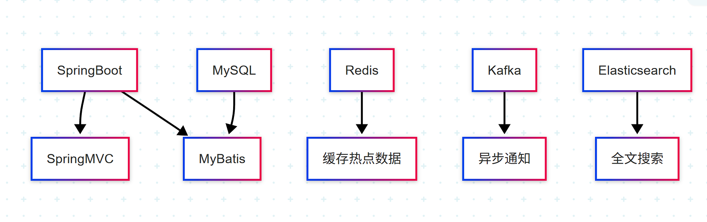
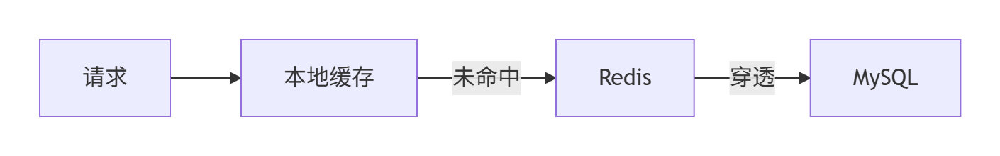

# 校内互动交流平台技术方案

## 一、项目概述
- **核心功能模块**：
  - ✅ 权限模块（JWT鉴权）
  - ✅ 帖子模块（CRUD+互动）
  - ✅ 性能模块（缓存+异步）
  - ✅ 通知模块（实时推送）
  - ✅ 搜索模块（全文检索）

## 二、技术架构

## 三、功能实现

1. **系统通知**
   - 使用 Kafka 作为消息队列。
   - 在用户被点赞、评论、关注后，以系统通知的方式推送给用户。
   - 确保系统通知的实时性和可靠性。

2. **热帖排行功能**
   - 使用 SpringQuartz 实现定时任务。
   - 设计和实现独立的排行榜算法，完成热门帖子的分数计算模块。
   - 根据帖子的热度值进行排序和展示。
   - 使用 Caffeine 作为本地缓存，Redis 作为二级缓存，提高数据的访问速度。

3. **搜索功能**
   - 使用 Elasticsearch 实现对帖子的搜索。
   - 支持结果高亮显示。

4. **日志记录**
   - 使用 SpringBoot AOP + 自定义注解，实现日志记录功能。

## 四、缓存模式

